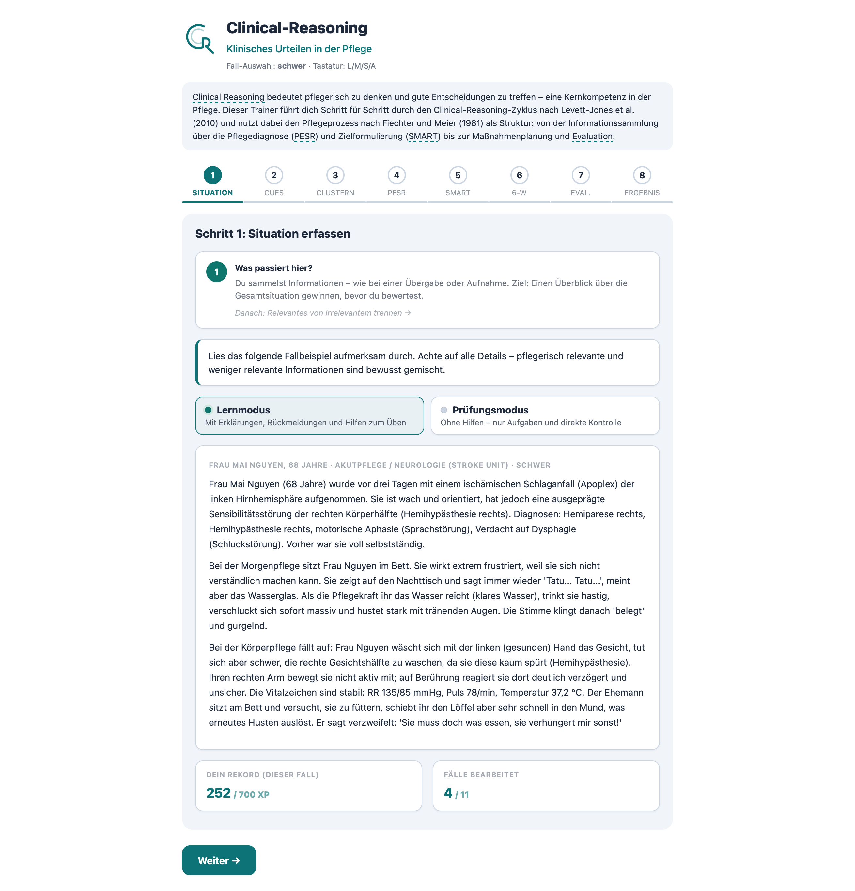
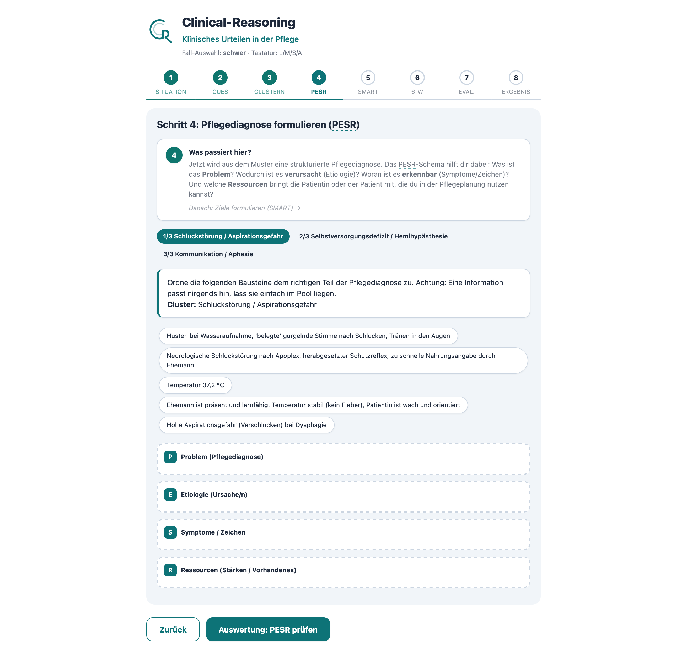
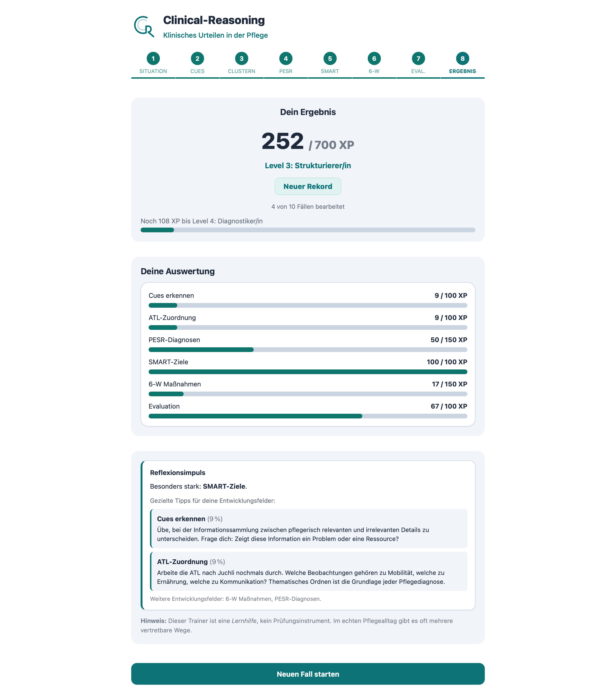

# Clinical-Reasoning-Trainer

**Klinisches Urteilen in der Pflege – interaktiv üben**

Klicken Sie hier zum Ausprobieren: [index.html](https://florianloyns.github.io/clinical-reasoning-trainer/index.html)

---

| Step 1: Situation erfassen | Step 4: Pflegediagnose (PESR) | Ergebnis & XP |
|:---:|:---:|:---:|
|  |  |  |

---

> Ein interaktives Lernwerkzeug für die generalistische Pflegeausbildung. Der Trainer führt Lernende Schritt für Schritt durch klinisches Pflegedenken – von der Situationserfassung über Pflegediagnose und Maßnahmenplanung bis zur Evaluation. Alles in einer einzigen HTML-Datei, ohne Installation, offline nutzbar.

---

## Inhalt

- [Wofür ist es gedacht](#wofür-ist-es-gedacht)
- [Didaktischer Rahmen](#didaktischer-rahmen)
- [Fallbeispiele](#fallbeispiele)
- [Features](#features)
- [Eigene Fälle ergänzen](#eigene-fälle-ergänzen)
- [Technisches](#technisches)
- [Datenschutz](#datenschutz)
- [Lizenz](#lizenz)

---

## Wofür ist es gedacht

Viele Lernende können Beobachtungen benennen – der nächste Schritt fällt schwer:

- Was ist jetzt pflegerisch wichtig?
- Was gehört zusammen?
- Was folgt daraus für Ziel und Maßnahme?
- Wie begründe ich das fachlich?

Der Trainer zerlegt Clinical Reasoning in kleine, übbare Schritte und macht den Denkweg sichtbar: **Beobachten → ordnen → begründen → planen → evaluieren**

Er ist keine reine Quiz-Seite, sondern eine **Übung zur Pflegeplanung** – mit realistischen Fällen, fachlicher Rückmeldung und einem Ablauf, der direkt an die Pflegeplanung anschließt. Geeignet für Einzelarbeit, Partnerarbeit oder Besprechung im Plenum – besonders in Lernphasen, in denen pflegerische Entscheidungen nicht nur benannt, sondern **begründet** werden sollen.

## Didaktischer Rahmen

Der Trainer orientiert sich am Pflegeprozess nach Fiechter und Meier (1981) sowie in Anlehnung an den Clinical-Reasoning-Zyklus nach Levett-Jones et al. (2010). Die Lernenden arbeiten in sieben inhaltlichen Schritten (plus Ergebnisseite):

1. **Situation erfassen** – Fall lesen und Überblick gewinnen
2. **Cues erkennen** – pflegerisch relevante Hinweise auswählen
3. **Informationen clustern** – Hinweise nach ATL thematisch ordnen
4. **Pflegediagnose (PESR)** – Problem, Etiologie, Symptome/Zeichen und Ressourcen zuordnen; Priorisierungsregel: akute vor potenziellen vor chronischen Problemen
5. **Ziele prüfen (SMART)** – Ziele fachlich bewerten
6. **Maßnahmen planen (6 W)** – Wer, Was, Wann, Wie oft, Wo, Warum?
7. **Evaluation** – Zielerreichung einschätzen und Maßnahme begründen

Die Fälle mischen bewusst relevante und irrelevante Informationen, wie es im Pflegealltag üblich ist. So wird nicht nur Wissen abgefragt, sondern auch Priorisieren und fachliches Begründen trainiert. Zentrale Fachbegriffe (Clinical Reasoning, ATL nach Juchli, PESR, SMART, 6 W, Cues) sind pro Schritt mit einem Tooltip versehen.

## Fallbeispiele

Der Trainer umfasst **11 Fälle** aus allen Vertiefungsbereichen der generalistischen Ausbildung. Die Fallrotation sorgt dafür, dass alle Fälle gespielt werden, bevor sich einer wiederholt.

Über die **Fall-Auswahl** lässt sich optional nach Schwierigkeitsgrad filtern (leicht / mittel / schwer / alle). Bedienung per Touch oder Tastatur (L / M / S / A).

| Name | Vertiefungsbereich | Schwerpunkt | Schwierigkeit |
|---|---|---|---|
| Yıldız Kara, 78 | Akutpflege | Dekubitus, Mangelernährung | leicht |
| Thomas Weber, 48 | Akutpflege | Postop. Schmerz, Mobilisation | mittel |
| Erna Schmidt, 84 | Akutpflege | Sturz, kognitive Einschränkung | mittel |
| Mai Nguyen, 68 | Akutpflege | Schlaganfall, Neglect | schwer |
| Nadja Petrow, 67 | Ambulante Pflege | Herzinsuffizienz, Selbstmanagement | schwer |
| Giovanni Esposito, 82 | Langzeitpflege | Demenz, Validation | mittel |
| Luka Metzger, 9 | Pädiatrie | Neurodermitis, Juckreiz | leicht |
| Amira Haddad, 11 | Pädiatrie | Diabetes Typ 1, Edukation | schwer |
| Ben Richter, 22 | Psychiatrie | Anpassungsstörung, Tagesstruktur | leicht |
| Anna Berger, 34 | Psychiatrie | Schwere Depression, Antrieb | mittel |
| Dariusz Kowalski, 54 | Psychiatrie | Depression, Suizidalität | mittel |

## Features

**Lernmodi**
- **Lernmodus** – mit Orientierungshinweisen, die erklären, was im jeweiligen Schritt trainiert wird und warum
- **Prüfungsmodus** – ohne Hinweise, direkt wie eine Lernerfolgskontrolle

**Feedback**
- Falsche Antworten werden nach Fehlerart eingeordnet (komplett daneben, teilweise richtig, überambitioniert) – jede Rückmeldung endet mit einem konkreten Tipp
- Richtige Antworten erklären, *warum* sie richtig sind, nicht nur, dass sie es sind
- Teilerfolge und nachvollziehbare Fehler werden ausdrücklich anerkannt
- **Individueller Reflexionsimpuls** am Ende: die Ergebnisseite analysiert die Einzelschritte und zeigt gezielte Tipps für die Bereiche, in denen Punkte verloren wurden – kein generischer Text, sondern schrittspezifisches Feedback

**Gamification**
- **XP-System** – 700 XP pro Durchlauf, gewichtet nach Schrittkomplexität (PESR und 6-W-Planung zählen stärker als Cue-Erkennung)
- **6 Level** – von Beobachter/in bis Clinical-Reasoning-Coach
- **Streak-Anzeige** – zählt aufeinanderfolgende Schritte mit ≥ 70 % Ergebnis
- **Highscore pro Fall** – speichert den besten Durchlauf lokal im Browser

## Eigene Fälle ergänzen

Die Falldaten stehen als JavaScript-Objekte direkt in der HTML-Datei (Suche nach `const fall1 =`). Struktur pro Fall:

- `titel`, `setting`, `schwierigkeit`, `text` – Fallbeschreibung und Metadaten
- `cues` – Hinweise mit `relevant: true/false` und Feedback
- `cluster` – ATL-Zuordnung nach Juchli (12 ATLs) mit Zielzonen
- `pes` – PESR-Diagnosen mit Drag-and-Drop-Feldern (P, E, S, R, X als Distraktoren) und `prioritaet`-Feld (akut / potenziell / chronisch)
- `smartZiele` – je 3 Optionen pro Cluster, eine SMART-konform
- `sechsW` – Lückentext mit Dropdown-Auswahl (Wer / Was / Wann / Wie oft / Wo / Warum)
- `evaluation` – Zielerreichung, Maßnahmenanpassung, Begründung

Neue Fälle werden ins `faelle`-Array aufgenommen und sind sofort spielbar. Tooltips, Level-System und Oberfläche passen sich automatisch an.

## Technisches

Eine einzelne HTML-Datei – kein Build, kein Framework, kein Server, keine externen Abhängigkeiten. Läuft vollständig im Browser, auch offline.

- Keine externen Ressourcen (keine CDN-Bibliotheken, keine Google Fonts, keine Tracker)
- Highscores und Filtereinstellungen werden lokal im Browser gespeichert (localStorage) – keine Daten verlassen das Gerät
- Mobile- und touchoptimiert
- **Dark Mode** – per Klick auf das Logo umschaltbar, respektiert die Systempräferenz, Einstellung wird gespeichert
- **PWA (Progressive Web App)** – auf iPhone und Android als App installierbar, danach auch offline nutzbar

### Als App auf dem iPhone installieren

1. Seite in **Safari** öffnen: [clinical-reasoning-trainer](https://florianloyns.github.io/clinical-reasoning-trainer/index.html)
2. Unten auf **Teilen** (Kasten mit Pfeil nach oben) tippen
3. **„Zum Home-Bildschirm"** wählen
4. CR-Trainer erscheint als App-Icon – startet fortan ohne Browser-Leiste, auch ohne Internetverbindung

> Auf Android: Chrome → Drei-Punkte-Menü → „App installieren"

## Datenschutz

Der Trainer ist als **datenschutzfreundliches Lernwerkzeug** konzipiert. Alle Verarbeitungsschritte geschehen lokal im Browser auf dem Endgerät der Lernenden. Konkret:

### Was der Trainer **nicht** tut

- **Keine Benutzerkonten, keine Anmeldung** – jede:r kann direkt loslegen
- **Keine Tracker** (kein Google Analytics, Matomo, Plausible, Sentry, Hotjar o. ä.)
- **Keine externen Scripte oder Bibliotheken** – alles, was geladen wird, stammt aus der eigenen HTML-Datei bzw. dem Icon-Ordner
- **Keine Google Fonts / Web-Fonts** – es wird ausschließlich der System-Font-Stack (`-apple-system`, `Segoe UI`, `Roboto` usw.) verwendet, d. h. keine externen Schriftrequests
- **Keine Cookies**
- **Keine Netzwerkaufrufe** zur Laufzeit (keine `fetch`-, `XMLHttpRequest`- oder `sendBeacon`-Aufrufe an Drittanbieter)

### Hosting auf GitHub Pages

Wird das Projekt über GitHub Pages ausgeliefert, sieht GitHub bei jedem Seitenabruf die IP-Adresse des Besuchers; das ist eine Eigenschaft des Hostings und nicht des Trainers selbst. Wer das vermeiden möchte, kann die HTML-Datei direkt vom eigenen Gerät oder einem Schul-Server ausliefern – der Trainer funktioniert ohne jede Änderung auch offline vom lokalen Dateisystem.

## Lizenz

[CC BY-NC-SA 4.0](https://creativecommons.org/licenses/by-nc-sa/4.0/deed.de) · Nutzen, anpassen und teilen – unter Namensnennung, nicht-kommerziell und unter gleichen Bedingungen.

---

**Weg vom Auswendiglernen, hin zu begründetem pflegerischem Handeln.**
